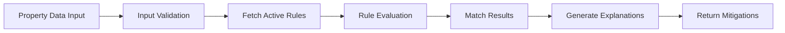

## 🛠 Technology Stack

### 🚀 Backend Framework & API

- **[FastAPI](https://fastapi.tiangolo.com/)** - Modern, fast web framework for building APIs
- **[Uvicorn](https://www.uvicorn.org/)** - ASGI server for running FastAPI
- **[Starlette](https://www.starlette.io/)** - Underlying web framework (FastAPI builds on this)
- **CORS Middleware** - Cross-origin resource sharing for frontend integration

### 🗄️ Database & ORM

- **[SQLite](https://www.sqlite.org/)** - Lightweight file-based database (`rules.db`)
- **[SQLModel](https://sqlmodel.tiangolo.com/)** - Modern ORM that combines SQLAlchemy + Pydantic
- **[SQLAlchemy](https://www.sqlalchemy.org/)** - Database toolkit and ORM engine

### ✅ Data Validation & Serialization

- **[Pydantic](https://docs.pydantic.dev/)** - Data validation using Python type annotations
- **Schemas** - Request/response models with field aliases and validation

### 🧠 Rules Engine

- **[JSON Logic](https://jsonlogic.com/)** - Rule evaluation engine for flexible business logic
- **[json-logic-py](https://github.com/qubitdigital/json-logic-py)** (qubit version) - Python 3 compatible implementation
- **[Jinja2](https://jinja.palletsprojects.com/)** - Template engine for dynamic explanation rendering

### 🧪 Testing Framework

- **[pytest](https://docs.pytest.org/)** - Python testing framework
- **[FastAPI TestClient](https://fastapi.tiangolo.com/tutorial/testing/)** - Built-in testing utilities
- **[httpx](https://www.python-httpx.org/)** - HTTP client library (required by TestClient)

## 🚀 Getting Started

### Prerequisites

- Python 3.12+
- pip package manager

### Installation

1. **Clone the repository**

   ```bash
   git clone <repository-url>
   cd mitigationDB
   ```

2. **Create and activate virtual environment**

   ```bash
   python -m venv env
   source env/bin/activate  # On Windows: env\Scripts\activate
   ```

3. **Install dependencies**

   ```bash
   pip install fastapi uvicorn sqlmodel pytest httpx json-logic-py jinja2
   ```

4. **Load initial rules**

   ```bash
   python scripts/load_rules.py
   ```

5. **Start the development server**

   ```bash
   uvicorn main:app --reload
   ```

6. **Access the application**
   - API: http://127.0.0.1:8000
   - Interactive Docs: http://127.0.0.1:8000/docs
   - ReDoc: http://127.0.0.1:8000/redoc

## 📖 API Documentation

### Core Endpoints

#### Evaluation Endpoints

```http
POST /api/v1/evaluate
```

Evaluate property observations against active rules.

**Request Body:**

```json
{
  "attic_vent_has_screens": "False",
  "roof_type": "Class B",
  "wildfire_risk_category": "C",
  "Window Type": "Double",
  "vegetation": [
    {
      "Type": "Tree",
      "distance_to_window": 40
    }
  ]
}
```

**Response:**

```json
{
  "matched": 2,
  "vulnerabilities": [
    {
      "vulnerability": "Ember-vulnerable vents",
      "category": "vents",
      "matched_rule_id": 1,
      "explanation": "Attic vents lack ember-resistant screens.",
      "mitigations": {
        "full": ["Install 1/8-inch metal mesh or ember-rated vent covers"],
        "bridge": [
          "Temporarily cover vents with fire-resistant fabric during Red-Flag periods"
        ]
      }
    }
  ]
}
```

#### Rules Management

```http
GET    /api/v1/rules/           # List all rules
POST   /api/v1/rules/           # Create new rule
GET    /api/v1/rules/{id}       # Get specific rule
PUT    /api/v1/rules/{id}       # Update rule
DELETE /api/v1/rules/{id}       # Delete rule
```

## 🧠 Rule System

### Rule Structure

Rules are defined using JSON Logic for flexible evaluation:

```json
{
  "name": "Window heat exposure",
  "category": "windows",
  "logic": {
    "<": [
      { "var": ["vegetation.0.distance_to_window"] },
      {
        "*": [
          { "var": "params.base_ft" },
          { "var": "params.window_mult.Double" }
        ]
      }
    ]
  },
  "params": {
    "base_ft": 30,
    "window_mult": { "Single": 3, "Double": 2, "Tempered Glass": 1 }
  },
  "explanation": "Window is vulnerable to vegetation heat-flux at current distance.",
  "mitigations": {
    "full": ["Replace windows with tempered glass"],
    "bridge": ["Apply heat-resistant window film"]
  }
}
```

### Rule Features

- **🔄 Versioning** - Rules have effective and retirement dates
- **📐 Parameters** - Reusable rules with configurable parameters
- **📝 Templates** - Dynamic explanations using Jinja2
- **🎯 Categories** - Organize rules by risk type (vents, roof, windows)
- **🛠️ Mitigations** - Both full solutions and temporary bridge measures

## 🧪 Testing

Run the test suite:

```bash
# Run all tests
pytest

# Run specific test file
pytest tests/test_evaluate.py

# Run with verbose output
pytest -v

# Run with coverage
pytest --cov=.
```

### Test Coverage

- ✅ Rule evaluation logic
- ✅ API endpoint validation
- ✅ Edge cases and error handling
- ✅ Multiple rule matching
- ✅ Input validation

## 🤝 Contributing

1. Fork the repository
2. Create a feature branch (`git checkout -b feature/amazing-feature`)
3. Commit your changes (`git commit -m 'Add some amazing feature'`)
4. Push to the branch (`git push origin feature/amazing-feature`)
5. Open a Pull Request

### Development Guidelines

- Write tests for new features
- Follow PEP 8 style guidelines
- Update documentation for API changes
- Use type hints throughout the codebase

## 📄 License

This project is licensed under the MIT License - see the [LICENSE](LICENSE) file for details.

## 🆘 Support

If you have questions or need help:

- 📧 Create an issue in this repository
- 📖 Check the [API Documentation](http://127.0.0.1:8000/docs)
- 🔍 Review existing tests for usage examples

---

## 🏗️ Architecture Overview

### Design Patterns & Structure

This application follows **Clean Architecture** principles with clear separation of concerns and modular design:

#### 🔄 **Repository Pattern**

```python
# Database access abstracted through sessions
def get_session():
    with Session(engine) as session:
        yield session
```

#### 🏢 **Service Layer Pattern**

```python
# Business logic separated from API routes
services/
└── rules_engine.py  # Core evaluation logic
```

#### 🛣️ **Router Pattern**

```python
# Modular API organization
routers/
├── evaluate.py  # POST /api/v1/evaluate
└── rules.py     # CRUD /api/v1/rules/*
```

#### 💉 **Dependency Injection**

```python
# FastAPI's built-in DI system
@router.post("/evaluate")
def evaluate_observation(
    input: ObservationInput,
    session: Session = Depends(get_session)  # ← Injected dependency
):
```

#### 📋 **Schema-Driven Development**

```python
# Pydantic models enforce data contracts
class ObservationInput(BaseModel):
    attic_vent_has_screens: Literal["True", "False"]
    roof_type: Literal["Class A", "Class B", "Class C"]
```

### 🎯 **Key Architectural Benefits**

- **🔌 Modular** - Easy to add new rule types and endpoints
- **🧪 Testable** - Clear boundaries enable comprehensive testing
- **📈 Scalable** - Service layer can be extracted to microservices
- **🔄 Maintainable** - Separation of concerns reduces coupling
- **🛡️ Type-Safe** - Pydantic + SQLModel provide end-to-end type safety

## 🎯 High Level Functionality Overview

### 🌟 Implemented Features

#### 🏠 **Property Risk Assessment**

- **Input Validation** - Structured property characteristic capture
- **Multi-Factor Evaluation** - Roof type, vents, windows, vegetation analysis
- **Risk Categorization** - Wildfire risk levels (A, B, C, D)
- **Distance Calculations** - Vegetation proximity to vulnerable areas

#### 🧠 **Intelligent Rules Engine**

- **JSON Logic Evaluation** - Flexible, declarative rule conditions
- **Dynamic Parameters** - Reusable rules with configurable thresholds
- **Template Explanations** - Context-aware vulnerability descriptions
- **Rule Versioning** - Time-based activation and retirement system

#### 💡 **Mitigation Strategy System**

- **Dual Approach** - Full solutions vs. temporary bridge measures
- **Categorized Recommendations** - Organized by vulnerability type
- **Actionable Guidance** - Specific, implementable suggestions
- **Risk-Appropriate** - Tailored to severity and property characteristics

#### 🔧 **Rule Management**

- **CRUD Operations** - Create, read, update, delete rules
- **Active Rule Filtering** - Query rules by effective date
- **Rule Testing** - Test individual rules against sample data
- **Bulk Loading** - Import rules from JSON configuration

### 🔄 User Flow Overview

#### 📊 **Assessment Workflow**



#### 🎯 **Typical User Journey**

1. **📝 Data Collection**

   ```json
   {
     "attic_vent_has_screens": "False",
     "roof_type": "Class B",
     "wildfire_risk_category": "C",
     "vegetation": [{ "Type": "Tree", "distance_to_window": 40 }]
   }
   ```

2. **🔍 Risk Evaluation**

   - System loads all active rules from database
   - Each rule's JSON Logic condition evaluated against property data
   - Parameters dynamically calculated (e.g., safe distances)

3. **⚠️ Vulnerability Detection**

   ```json
   {
     "matched": 2,
     "vulnerabilities": [
       {
         "vulnerability": "Ember-vulnerable vents",
         "category": "vents",
         "explanation": "Attic vents lack ember-resistant screens."
       }
     ]
   }
   ```

4. **🛠️ Mitigation Recommendations**
   - **Full Solutions**: Permanent fixes (e.g., "Install Class A roof covering")
   - **Bridge Measures**: Temporary protection (e.g., "Apply fire-resistant coating")

#### 🔧 **Administrative Workflow**

1. **Rule Creation/Updates**

   ```bash
   POST /api/v1/rules/
   PUT /api/v1/rules/{id}
   ```

2. **Rule Testing**

   ```bash
   POST /api/v1/rules/{id}/test
   ```

3. **Bulk Rule Management**
   ```bash
   python scripts/load_rules.py
   ```

### 🎁 **Value Proposition**

- **🏠 Homeowners** - Get specific, actionable wildfire protection guidance
- **🏢 Insurance Companies** - Assess and price wildfire risk accurately
- **🚒 Fire Departments** - Prioritize mitigation efforts in high-risk areas
- **🏛️ Municipalities** - Develop data-driven fire safety policies
- **🔧 Contractors** - Identify and scope wildfire mitigation projects
